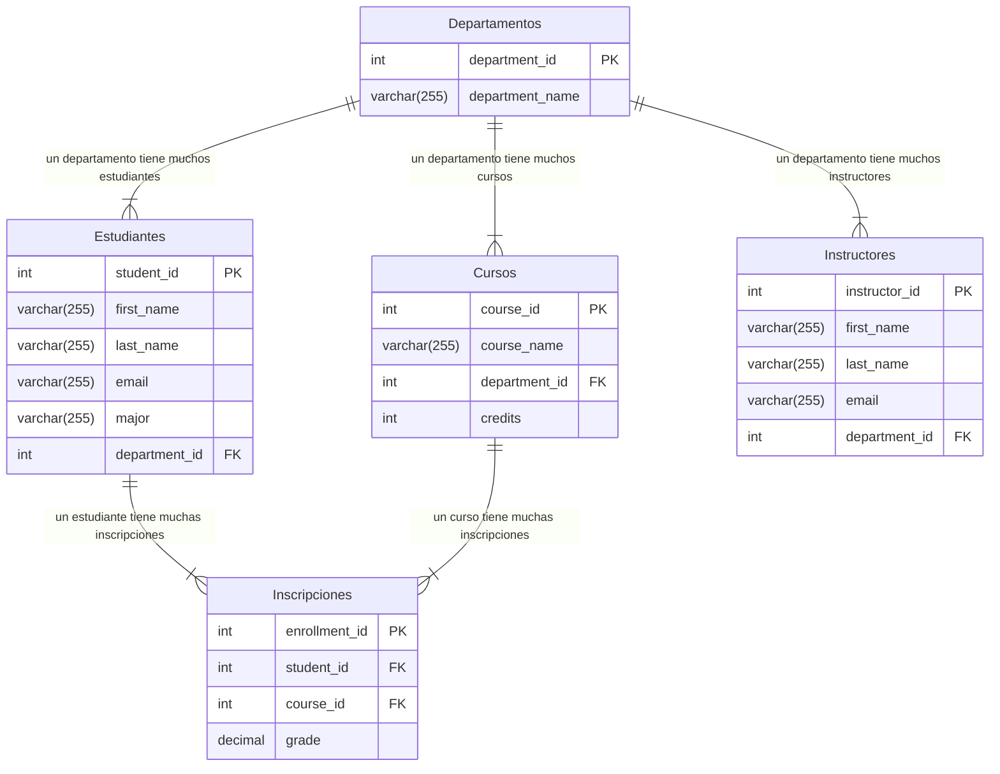

# database

```mermaid
erDiagram
    Departamentos {
        int department_id PK
        varchar(255) department_name
    }

    Estudiantes {
        int student_id PK
        varchar(255) first_name
        varchar(255) last_name
        varchar(255) email
        varchar(255) major
        int department_id FK
    }

    Cursos {
        int course_id PK
        varchar(255) course_name
        int department_id FK
        int credits
    }

    Instructores {
        int instructor_id PK
        varchar(255) first_name
        varchar(255) last_name
        varchar(255) email
        int department_id FK
    }

    Inscripciones {
        int enrollment_id PK
        int student_id FK
        int course_id FK
        decimal grade
    }

    Departamentos ||--|{ Estudiantes : "un departamento tiene muchos estudiantes"
    Departamentos ||--|{ Cursos : "un departamento tiene muchos cursos"
    Departamentos ||--|{ Instructores : "un departamento tiene muchos instructores"
    Estudiantes ||--|{ Inscripciones : "un estudiante tiene muchas inscripciones"
    Cursos ||--|{ Inscripciones : "un curso tiene muchas inscripciones"
```
